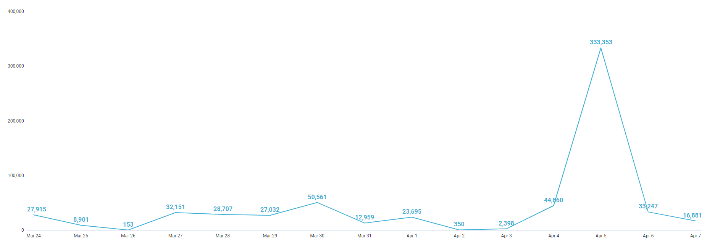
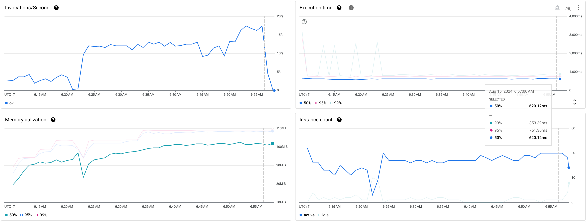
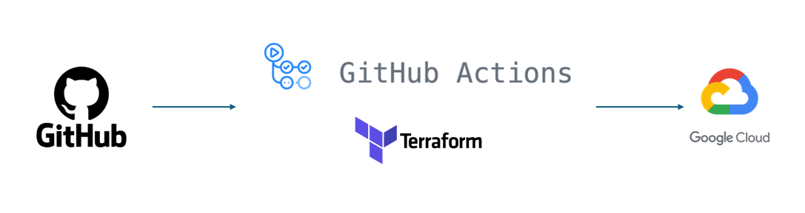

# Keep-on-Track of Hundred-Thousands of Google Cloud Storage (GCS) Object with Go-base Cloud Function, Provisioned with Terraform

## Behind Story

As data team, specificly data engineer, it is common to receive many data in various file format , such as CSV, or TXT file.<br>
This file then will be processed in PySpark as an ETL process, or just loaded with table connector to data warehouse, <br>
and transformed later using native SQL or data modelling framework like DBT, Dataform, etc.<br>
As it become daily process, we have to take a track on the new, modified, or deleted file.

Here is our daily (current) basis on how much file is being ingested to our GCS bucket in 1 project.



The current cloud function currently was able to perform this task with specification and performance below.

- Code Language: Python
- CPU: XXXX
- Memory: 256 MiB
- Max instance count: 50



As visualized in picute above, the mean performance (50% percentile) was below.

- Invocations/Seconds: ~15 requests/seconds
- Execution time per request: 800ms per request
- Memory: 105 Mib
- Instance count: 20

Our requirements for upcoming task was how to reduce the execution time per request, because the information logged with this CF will be used for SensorOperator in Airflow. Longer time to process means airflow have to wait more longer. There is no specific number for the execution time goal (because it relay on bigquery api as well), but we were hoping it will be under 100.

More details about our solution is explained below.

## Introduction

This article will explain on how to increase the performance of a Python base cloud function to store logs of GCS object activity in Google BigQuery.<br>
Cloud Function will still be used as a service, built using Terraform as Infrastruture as a Code (IaaC).

<br>

\*_This explanation is a research, do not directly use it as Production._

## Source Code

This article source code stored in [this repository](./).

## Architecture

This figure shows complete architecture of our research.


<br>
<br>
<br>
<br>
<br>
<br>
<br>
<br>
<br>
<br>
<br>
<br>
<br>
<br>
<br>
<br>
<br>
<br>
<br>
<br>
<br>

High level diagram of our solution can be shown below.



Our solution is using GitHub for Remote Repository, and using GH Action for CICD workflows.<br>
For more information about Terraform GitHub Action, is explained in [this documentation](https://developer.hashicorp.com/terraform/tutorials/automation/github-actions).

To perform GitHub Action, we do need a service account.<br>
To create a service account in GCP and giving permission for the account, please do refer [this documentation](https://cloud.google.com/iam/docs/service-accounts-create).<br>
The service account is then stored in [GitHub Secret](https://docs.github.com/en/actions/security-guides/using-secrets-in-github-actions).

In this workflows, GitHub Action is separated into 2 files.<br>
First, for `terraform plan` command, which will run automatically when there is any push or pull request to `main` branch.<br>
And, `terraform apply` command, which will be manually trigger.

```bash
cd src
go mod init github.com/ilhamhanif/gcs-bucket-notif-log-bq
```

Initialize package

```bash
go mod tidy
```

### Reference

[How to create Go base Cloud Function](https://cloud.google.com/functions/docs/create-deploy-http-go#create_your_function)
[How to build infrastructure in one-go-command using Terraform](https://medium.com/cloud-native-daily/deploy-cloud-functions-on-gcp-with-terraform-c6026be9d645)

sudo snap install terraform
https://developer.hashicorp.com/terraform/tutorials/aws-get-started/install-cli
https://medium.com/cloud-native-daily/deploy-cloud-functions-on-gcp-with-terraform-c6026be9d645
https://registry.terraform.io/providers/hashicorp/google/latest/docs
https://registry.terraform.io/providers/hashicorp/archive/latest/docs/resources/file
https://cloud.google.com/source-repositories/docs/mirroring-a-github-repository
