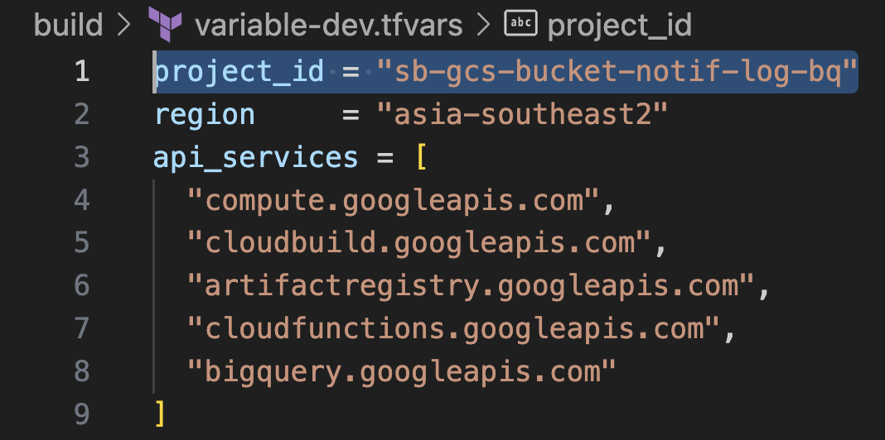
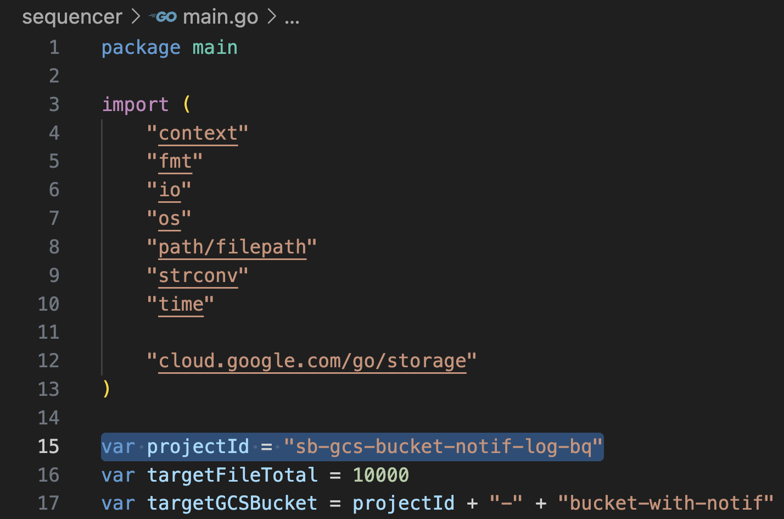
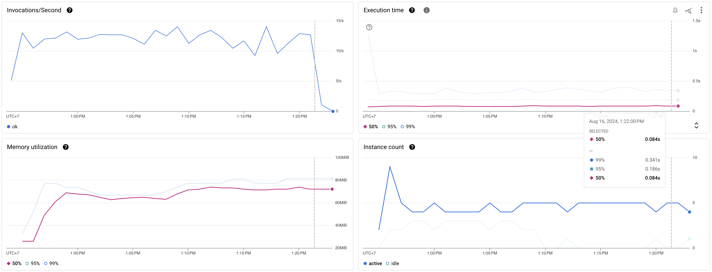
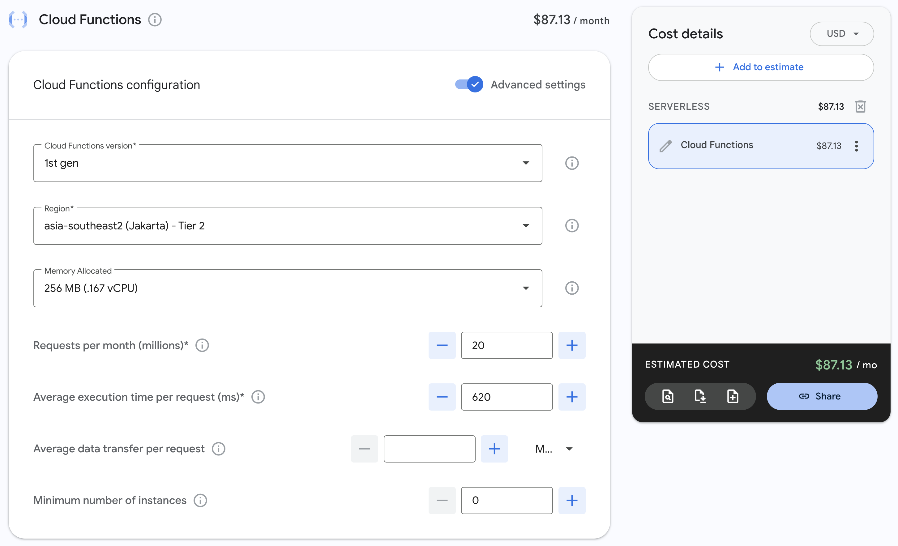
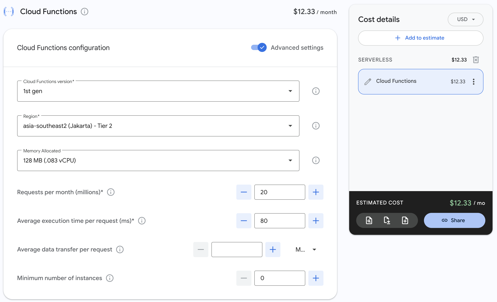

# Keep-on-Track of Hundred-Thousands of Google Cloud Storage (GCS) Object with Go-base Cloud Function, Provisioned with Terraform

## Behind Story

As data engineer, it is common to receive files with different format, such as CSV or TXT.<br>
This files, then, will be processed with an ETL process using service like [Spark](https://spark.apache.org/), [GCP Dataflow](https://cloud.google.com/dataflow), etc, or just be loaded with a data warehouse connector,<br>
and be transformed later using native SQL or data modelling framework like [DBT](https://www.getdbt.com/), [Dataform](https://cloud.google.com/dataform), etc.

As other services become relay to this process, performance has to be considered.

## Introduction

We were using Google Cloud Storage (GCS) as our data lake with bucket notification to track all of object activities within it had been enabled. This notification will send JSON formatted message to GCP PubSub as message broker before it is forwarded the message to Python-based Cloud Function (CF) and is stored in Google BigQuery (BQ). The architecture will be showed in [Architecture](#architecture) section.

Our daily (current) trend of incoming new file that was ingested to our GCS showed below.


Our Cloud Function currently was able to track the activity with specification and performance below.

- Code language: Python
- Memory allocated: 256 MiB
- Max instance count: 50


As visualized in the picture, the Cloud Function was able to gave performance with **mean performance (50% percentile)** mentioned below.

- Requests per second: ~15 requests/seconds
- Execution time per request: 620 ms per request
- Memory usage: 105 Mib
- Instance count used (maximum): 20

## What's This Article Goal?

The goal for this article is how to **reduce the execution time per request** by migrating the code language from Python to Golang, because the information logged by this Cloud Function will be used by [SensorOperator in Apache Airflow](https://airflow.apache.org/docs/apache-airflow/stable/core-concepts/sensors.html). The longer it takes to process means Airflow have to wait longer, which in result will block the worker pool from doing any other tasks. <br>
There is no specific number for this goal (because it also relay on BigQuery API), but this article will set the target **under 100 ms**.

Cloud Function will be retained, but this article will add [Terraform as Infrastruture as a Code (IaaC)](https://www.terraform.io/use-cases/infrastructure-as-code) to provision all of the necessary services.

\*_This article is purposed for research._<br> \*_For Production uses, some tweak have to be made, which will be mentioned below._

## Source Code

This article source code was stored in [this repository](./).

## Architecture

This figure shows complete architecture of our research. Overall, there are no services were replaced.


All of the service will be deployed and documented by Terraform with the service variable and resources stack available under `/build` folder.

## Build

1. Clone the source code from GitHub repository.

```bash
git clone https://github.com/ilhamhanif/gcs-bucket-notif-log-bq.git
cd gcs-bucket-notif-log-bq
```

2. Deploy all of the services with Terraform

Ensure to create a project in GCP by following [this official documentation](https://developers.google.com/workspace/guides/create-project). All of the API(s) required had been declared and will automatically enabled by Terraform.

Make sure to change the _**project_id**_ variable under `/build/variable-dev.tfvars` file.



Then deploy all the services with following commands.

```bash
bash terraform-run.sh init -upgrade
bash terraform-run.sh build deploy variable-dev
```

## Demonstration

This following steps will be used during demonstration.

1. Running the object sequencer
2. Check the data in BigQuery
3. Check Cloud Function performance
4. Cleaning Up

### 1. Running the Object Sequencer

A script `main.go` had been created to orchestrate GCS objects under `/sequencer` folder.
This sequencer script will create 10000 files in GCS and directly delete it after which create 20000 events total to be processed in Cloud Function.

Make sure to change the _**project_id**_ variable to match your GCP Project ID created before.



Run the sequencer with this command.

```bash
cd sequencer
go run main.go
```

### 2. Check the data in BigQuery

A test script `sequencer_test.go` had been created under `/test` folder. This test script will check all events that had been successfully processed by Cloud Function and stored in BQ. Each event will have 10000 rows respectively, same as number of files orchestrated in demonstration step 1.

Make sure to change the _**project_id**_ and _**job_id**_ that can be found from sequencer return value printed in console.


Run this test using this following commands.

```bash
cd test
go test -v sequencer_test.go
```

### 3. Check Cloud Function Performance

Go to [Cloud Function page](https://console.cloud.google.com/functions/details/asia-southeast2/gcs-bucket-notif-bq-log) to check the performance.



As visualized in the picture, the Cloud Function was able to gave performance with **mean performance (50% percentile)** mentioned below.

- Requests per second: ~13 requests/seconds
- Execution time per request: 80 ms per request
- Memory usage: 70 Mib
- Instance count used (maximum): 5

To summarized, the **execution time per requests was reduced by 87% from 620 ms to 80 ms** per request, which implied the **maximum number of used instances reduced by 15 instances from 20 to 5 instances**, and the **memory usage reduce by 30% from to 105MiB to 70 MiB**. The reduce of memory usage allow us to **reduce the allocation memory from 256 MiB to 128 MiB**. Despite the less instance and memory usage, it still _able to handle the same rate of requests per second_.

If this system is scaled to receive 20 millions requests per month, **it will cut the price from $87 to $12** (calculated with [Google Cloud Pricing Calculator](https://cloud.google.com/products/calculator)).

|                                Before                                |                                   After                                    |
| :------------------------------------------------------------------: | :------------------------------------------------------------------------: |
|  |  |

### 4. Cleaning Up

Use the command below to clean up everything.

```bash
bash terraform-run.sh destroy variable-dev
```

## Improvement

As mentioned above, this article is supposed to be a research report. Several tweaks and improvements are needed t use it in Production, which will mentioned below.

1. Consider to create a CI/CD process which elaborate the Terraform stack and code changes in Git repository.
2. Consider to use other Terraform backend aside from local backend used in this article, like GCS, S3, or any other backend which can be found in document under reference below.
3. Collaborate with your team to define the best folder stack for all the infrastructures (consider to use [Terraform Modules](https://developer.hashicorp.com/terraform/language/modules)).
4. Etc.

## Reference

- [Installing Terraform](https://developer.hashicorp.com/terraform/tutorials/aws-get-started/install-cli)
- [Terraform - Backend](https://developer.hashicorp.com/terraform/language/settings/backends/configuration)
- [Terraform - Variable](https://developer.hashicorp.com/terraform/language/values/variables)
- [Terraform - GCP Provider](https://registry.terraform.io/providers/hashicorp/google/latest/docs)
- [Terraform - GCP API](https://registry.terraform.io/providers/hashicorp/google/latest/docs/resources/google_project_service)
- [Terraform - GCP GCS](https://registry.terraform.io/providers/hashicorp/google/latest/docs/resources/storage_bucket)
- [Terraform - GCP PubSub Topic](https://registry.terraform.io/providers/hashicorp/google/latest/docs/data-sources/pubsub_topic)
- [Terraform - GCP PubSub Subscription](https://registry.terraform.io/providers/hashicorp/google/latest/docs/data-sources/pubsub_subscrip)
- [Terraform - GCP Cloud Function](https://registry.terraform.io/providers/hashicorp/google/latest/docs/resources/cloudfunctions_function)
- [Terraform - GCP BigQuery Dataset](https://registry.terraform.io/providers/hashicorp/google/latest/docs/resources/bigquery_dataset)
- [Terraform - GCP BigQuery Table](https://registry.terraform.io/providers/hashicorp/google/latest/docs/resources/bigquery_table)
- [Terraform - Output](https://developer.hashicorp.com/terraform/language/values/outputs)
- and many more, thanks to all.

## Another Related Topic

- [Terraform Backend with GCP GCS](https://developer.hashicorp.com/terraform/language/settings/backends/gcsclo)
- [How to create Go base Cloud Function](https://cloud.google.com/functions/docs/create-deploy-http-go#create_your_function)
- [How to build infrastructure in one-go-command using Terraform](https://medium.com/cloud-native-daily/deploy-cloud-functions-on-gcp-with-terraform-c6026be9d645)
- [CI CD with Terraform](https://medium.com/cloud-native-daily/deploy-cloud-functions-on-gcp-with-terraform-c6026be9d645)
