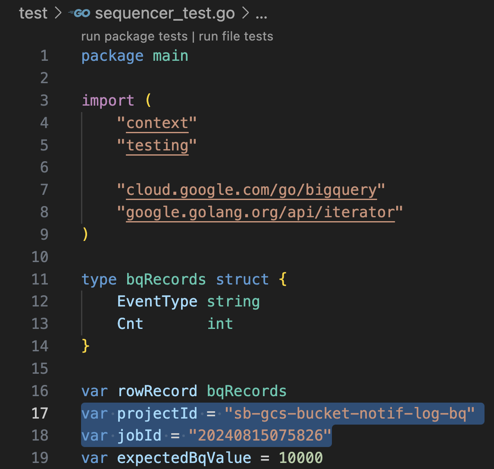

# Keep-on-Track of Hundred-Thousands of Google Cloud Storage (GCS) Object with Go-base Cloud Function, Provisioned with Terraform

## Behind Story

As data engineer, it is common to receive files with different format, such as CSV or TXT file.<br>
This file, then, will be processed with an ETL process using service like Spark, Dataflow, etc, or just be loaded with a data warehouse connector,<br>
and transformed later using native SQL or data modelling framework like DBT, Dataform, etc.

As other services relay to this process, performance has to be considered.

## What's This Article Goal?

The goal for this article is how to **reduce the execution time per request**, because the information logged by this CF will be used for SensorOperator in Apache Airflow. The longer it takes to process means Airflow have to wait more longer, which in result will block the worker pool for doint any other tasks. <br>
There is no specific number for this goal (because it also relay on BigQuery API), but this article will set the target **under 100 ms**.

<br>

\*_This article is purposed for research._<br> \*_For Production uses, some tweak have to be done, which will be mentioned below._

## Introduction

We were using Google Cloud Storage (GCS) as our data lake with bucket notification to track all of object activity enabled. This notification will be pushed to GCP PubSub as message broker before consumed by Python-based Cloud Function (CF) and stored in Google BigQuery (BQ). The architecture will be showed in **Architecture** section.

Our daily (current) trend of incoming new file that was ingested to our data lake showed below.


Our Cloud Function currently was able to track the activity with specification and performance below.

- Code Language: Python
- Memory: 256 MiB
- Max instance count: 50

<br>


As visualized in the picture, the Cloud Function was able to gave performance with _mean_ performance (50% percentile) mentioned below.

- Invocations per seconds: ~15 requests/seconds
- Execution time per request: 800 ms per request
- Memory: 105 Mib
- Instance count used (maximum): 20

This article will explain on how to increase the execution time speed per request of this Cloud Function by migrating the code language from Python to Golang.<br>
Cloud Function will be retained, but this article will add Terraform as Infrastruture as a Code (IaaC) to provision all of the necessary services.

## Source Code

This article source code was stored in [this repository](./).

## Architecture

This figure shows complete architecture of our research.


All of the service will be deployed and documented by Terraform with the service variable was available under /build folder.

## Build

1. Clone the source code from GitHub repository.

```bash
git clone https://github.com/ilhamhanif/gcs-bucket-notif-log-bq.git
cd gcs-bucket-notif-log-bq
```

2. Deploy all of the service with Terraform

Ensure to create a project in GCP by following [this official documentation](https://developers.google.com/workspace/guides/create-project). All of the API(s) required had been declared and will automatically enabled by Terraform.

Make sure to change the project_id variable.


Then deploy all the service with following commands.

```bash
bash terraform-run.sh init -upgrade
bash terraform-run.sh build deploy variable-dev
```

## Demonstration

This following steps will be used during demonstration.

1. Running the object sequencer
2. Check the data in BigQuery
3. Check Cloud Function performance
4. Cleaning Up

### 1. Running the Object Sequencer

A script main.go had been created to orchestrate GCS objects under /sequencer folder.
This sequencer script will create 10000 files in GCS and directly delete it after.
It will create total 20000 events to be processed in Cloud Function.

Make sure to change the project_id variable to match your GCP Project ID created above.


Run the sequencer with this command.

```bash
cd sequencer
go run main.go
```

### 2. Check the data in BigQuery

A test script had been created under /test folder. This test script will check all event that had been successfully stored in BQ. Each event (create and delete object) will have 10000 rows respectively, same as number of files orchestrated in demonstration step 1.

Make sure to change the project_id and job_id. job_id can be taken from sequencer printed value in console.



Run this test using this following commands.

```bash
cd test
go test -v sequencer_test.go
```

### 3. Check Cloud Function Performance

Go to [Cloud Function page](https://console.cloud.google.com/functions/details/asia-southeast2/gcs-bucket-notif-bq-log) to check the performance.


As visualized in the picture, the Cloud Function was able to gave performance with _mean_ performance (50% percentile) mentioned below.

- Invocations per seconds: ~13 requests/seconds
- Execution time per request: 80 ms per request
- Memory: 70 Mib
- Instance count used (maximum): 5

### 4. Cleaning Up

Use command below to clean up everything.

```bash
bash terraform-run.sh destroy variable-dev
```

## Improvement

As mentioned above, this article supposed to be a research report. To use it in Production, several tweaks and improvements are needed, which will mentioned below.

1. Consider to create a CI/CD process which elaborate the Terraform script stack and code changes in any Git repository.
2. COnsider to use any other Terraform backend aside from local backend used in this article, like GCS, S3, or any other backend which can be found in document under reference below.
3. Collaborate with your team to consider how to create a folder stack for all the infrastructure. Also consider to use [Terraform Modules](https://developer.hashicorp.com/terraform/language/modules).

## Reference

- [Installing Terraform](https://developer.hashicorp.com/terraform/tutorials/aws-get-started/install-cli)
- [Terraform - Backend](https://developer.hashicorp.com/terraform/language/settings/backends/configuration)
- [Terraform - Variable](https://developer.hashicorp.com/terraform/language/values/variables)
- [Terraform - GCP Provider](https://registry.terraform.io/providers/hashicorp/google/latest/docs)
- [Terraform - GCP API](https://registry.terraform.io/providers/hashicorp/google/latest/docs/resources/google_project_service)
- [Terraform - GCP GCS](https://registry.terraform.io/providers/hashicorp/google/latest/docs/resources/storage_bucket)
- [Terraform - GCP PubSub Topic](https://registry.terraform.io/providers/hashicorp/google/latest/docs/data-sources/pubsub_topic)
- [Terraform - GCP PubSub Subscription](https://registry.terraform.io/providers/hashicorp/google/latest/docs/data-sources/pubsub_subscrip)
- [Terraform - GCP Cloud Function](https://registry.terraform.io/providers/hashicorp/google/latest/docs/resources/cloudfunctions_function)
- [Terraform - GCP BigQuery Dataset](https://registry.terraform.io/providers/hashicorp/google/latest/docs/resources/bigquery_dataset)
- [Terraform - GCP BigQuery Table](https://registry.terraform.io/providers/hashicorp/google/latest/docs/resources/bigquery_table)
- [Terraform - Output](https://developer.hashicorp.com/terraform/language/values/outputs)

## Another Related Topic

- [Terraform Backend with GCP GCS](https://developer.hashicorp.com/terraform/language/settings/backends/gcsclo)
- [How to create Go base Cloud Function](https://cloud.google.com/functions/docs/create-deploy-http-go#create_your_function)
- [How to build infrastructure in one-go-command using Terraform](https://medium.com/cloud-native-daily/deploy-cloud-functions-on-gcp-with-terraform-c6026be9d645)
- [CI CD with Terraform](https://medium.com/cloud-native-daily/deploy-cloud-functions-on-gcp-with-terraform-c6026be9d645)
